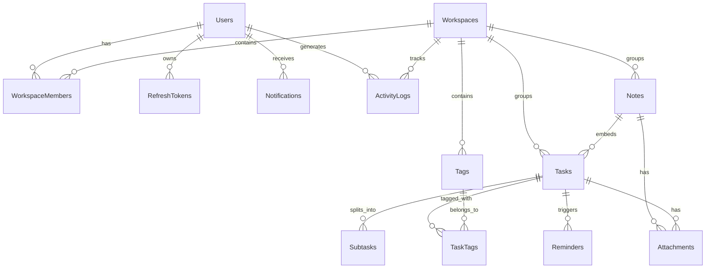

# Sơ đồ Thực thể Liên kết & Quan hệ (ERD & Relationships)

Dưới đây là sơ đồ kiến trúc Cơ sở dữ liệu (Database Architecture) cho ZenNote, được thiết kế chuyên biệt để mở rộng theo mô hình SaaS B2B/B2C.

## 1. Sơ đồ ERD (Entity Relationship Diagram)

## 2. Chiến lược Chuẩn hóa (Normalization Strategy)
Cơ sở dữ liệu được thiết kế đạt chuẩn **3NF (Third Normal Form)**:
- Không có dữ liệu lặp lại (No Data Redundancy): Các thành phần dùng chung như `Tags` được tách riêng và liên kết qua bảng trung gian `TaskTags`.
- Cấu trúc `Workspace` đóng vai trò là "Ranh giới Dữ liệu" (Data Boundary) còn được gọi là Multi-tenant architecture. Điều này cho phép mở rộng (Sharding) sau này cực kì dễ dàng.

## 3. Lý do Hình thành Quan hệ (Relationship Explanations)
- **Users <-> Workspaces (Many-to-Many qua WorkspaceMembers)**: Một user có thể tham gia nhiều Workspace (Cá nhân, Công ty, Gia đình), và một Workspace có thể có nhiều Users (Team collaboration).
- **Workspaces <-> Notes/Tasks/Tags (One-to-Many)**: Mọi dữ liệu cốt lõi đều được gắn vào một `WorkspaceId`. Thiết kế này giúp truy vấn cách ly dữ liệu giữa các tenant cực nhanh và an toàn (tránh data rò rỉ chéo).
- **Notes <-> Tasks (One-to-Many / Nullable)**: Một Task có thể được trích xuất từ một Note gốc. Việc liên kết `NoteId` vào Task giúp người dùng bấm từ To-Do List nhảy thẳng về file văn bản gốc.
- **Tasks <-> Subtasks (One-to-Many)**: Tách riêng bảng `Subtasks` hoặc sử dụng đệ quy (ParentTaskId) trên cùng bảng `Tasks`. Để quản lý khối lượng công việc đơn giản như TickTick, sử dụng `ParentTaskId` trên bảng Tasks là tối ưu nhất.
- **Tasks <-> Tags (Many-to-Many qua TaskTags)**: Giúp lọc và tìm kiếm chéo nhiều loại công việc theo context (ví dụ: #urgent, #home).

## 4. Quy ước Đặt tên (Naming Conventions)
- **Table Names**: `snake_case`, số nhiều (ví dụ: `workspace_members`, `activity_logs`).
- **Column Names**: `snake_case` (ví dụ: `created_at`, `is_deleted`).
- **Primary Keys**: Luôn luôn là `id` (Kiểu CHAR(36) UUID hoặc Binary(16) để tối ưu index).
- **Foreign Keys**: `[singular_table_name]_id` (ví dụ: `workspace_id`, `user_id`).
- **Boolean fields**: Bắt đầu bằng `is_` hoặc `has_` (ví dụ: `is_deleted`, `is_completed`).
